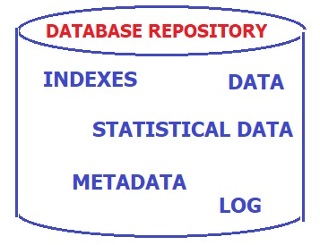

## [Tópico T05] - Sistema gerenciador de banco de dados
###### *by Prof. Plinio Sa Leitao-Junior (INF/UFG)*

Um Sistema de Gerenciador de Banco de Dados (SGBD) é um **software** que apoia os usuários na criação e manutenção de um banco de dados. O termo ***usuários*** é empregado aqui com sentido amplo e inclui: *administrador de banco de dados*, *projetista de banco de dados*, *usuário final*, *programador de aplicação*, etc.

O SGBD atua nos processos de definição, construção, manipulação e compartilhamento de bancos de dados entre usuários e aplicações:
- **Definição de banco de dados:** se refere à especificação de tipos de dados, estruturas de dados, regras e restrições de integridade, etc., que são armazenadas no dicionário (catálogo) de dados.
- **Construção de banco de dados:** denota a armazenagem de dados em meio controlado pelo SGBD; noutras palavras é a carga inicial do banco de dados.
- **Manipulação de banco de dados:** lida com a consulta ao banco de dados para *recuperar* dados específicos, e a atualização do banco de dados para *estar em sintonia* com os dados do mundo real.
- **Compartilhamento de banco de dados**. visa ao acesso simultâneo de vários usuários e programas ao banco de dados.

O SGBD deve trabalhar uniformemente com vários tipos de aplicação de banco de dados – por exemplo, universidade, instituição bancária, etc. – sempre utilizando a *definição de dados* gravada no catálogo.

> **O SGBD é de propósito geral. Os metadados são de propósito específico.**
> 
A Figura à esquerda abaixo mostra um **sistema de banco de dados** genérico, em que usuários interagem com programas de aplicação por meio de suas *interfaces*. O acesso propriamente dito aos dados ocorre por meio do SGBD que, por sua vez, necessita dos metadados para atender às solicitações oriundas dos usuários. 

A figura à direita abaixo apresenta um escopo mais amplo sobre o banco de dados, que inclui vários conteúdos adicionais aos dados: dicionário de dados, índice, dados estatísticos. Nesse sentido, o SGBD emprega os conteúdos adicionais para aprimorar o desempenho de suas funções. Por exemplo, o SGBD avalia se há a presença de um índice que possa ser aplicado a uma operação específica, tal que torne o atendimento a tal operação mais eficiente (em tempo).

Algumas benefícios potenciais para o emprego de SGBDs são:
- suporte a múltiplas visões dos dados;
- compartilhamento de dados entre múltiplos usuários;
- consistência transacional;
- restrição de acesso aos dados para usuários não autorizados;
- suporte à redundância controlada;
- garantia da restrição de integridade, que mantém os dados íntegros (consistentes);
- mecanismos de segurança dos dados, tais como, cópia (*backup*) e recuperação (*recovery*) de dados;
- etc.

A Figura a seguir explora os _componentes_ da **Arquitetura de um SGBD** típico, conforme [1].

## Atividade (data limite: 17/06/2022 23h59min59s)

Considere os seguintes componentes da **Arquitetura de um SGBD** típico (identificados de 1 a 6):

1. Concurrency control
2. Transaction manager
3. Query compiler
4. Logging and recovery
5. Buffer manager
6. Execution engine

**A presente atividade se refere a pesquisar e escrever sobre um desses componentes**, dentre os elencados acima.

O componente é identificado a partir da primeira letra do seu primeiro nome:
|Observe o número que segue cada letra|
|-|
|A1B2C3D4E5F6G1H2I3J4K5L6M1N2O3P4Q5R6S1T2U3V4W5X6Y1Z2|

Alguns exemplos:
- para o nome é **Bia**, o número que segue a letra **B** é 2, então o componente é "**2. _Transaction manager_**".
- para o nome é **Pedro**, o número que segue a letra **P** é 4, então o tipo de metadado é "**4. _Logging and recovery_**".

Criar uma _issue_ no projeto https://github.com/plinioleitao/bd-2022-1-bec, com o título "Tópico 05", para responder:  
1. Pesquise sobre um dos comonentes da arquitetura típica de um SGBD (escolhido conforme o seu primeiro nome). Então escreva um ou dois parágrafos sobre o mesmo, se possível inclua exemplos. Apresente também as fontes que você usou na sua pesquisa, evite copiar, traga a sua interpretação.
   
## Artefatos

1. _Issue_ criada no projeto https://github.com/plinioleitao/bd-2022-1-bec, cujo título é "Tópico 05", para indicar suas reflexões sobre *componentes da arquitetura de um SGBD*.

### Referências

[1] Hector Garcia-Molina (Autor), Jeffrey D. Ullman (Autor), Jennifer Widom. Database Systems: The Complete Book, segunda edição, Pearson Prentice Hall.
